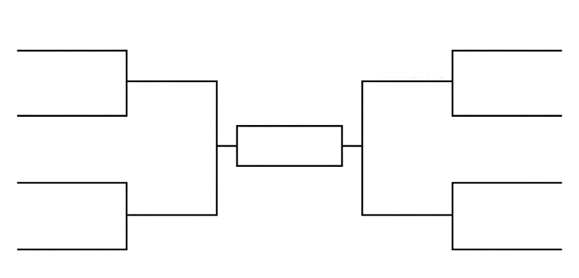

Think about the probabilities involved and fill out a March Madness bracket

{width=100%}

Watch out this [great video](https://www.youtube.com/watch?v=JW3_BxNYrkY) from Six-Minute Math about the mathematics of March Madness.

Then use our [STEMcoding Bracket Builder](http://explore.stemcoding.org/bracket.html) to fill out a bracket and print it out. Boys can choose the men's bracket and girls can choose the women's bracket. Note that OUR SITE DOES NOT SAVE ANY STUDENT DATA WHATSOEVER!!!

Notice on the [STEMcoding Bracket Builder](http://explore.stemcoding.org/bracket.html) each bracket has a different number attached to it.

* Why is does the binary number have as many digits as it has?
* Why is there 9.2 quadrillon possible brackets? Of the 9.2 quadrillon possible brackets, which number is your bracket according to the [STEMcoding Bracket Builder](http://explore.stemcoding.org/bracket.html)?
* Of the three different codes (Binary, Base 10 and Hexadecimal) why is the length of those codes from longest to shortest: Binary, Base 10 and Hexadecimal?
* How is the QR code storing the Share URL? How many different possible QR codes are there?

Check your brackets later to see how you did!

## Links to Activity
* [STEMcoding Bracket Builder](http://explore.stemcoding.org/bracket.html)

