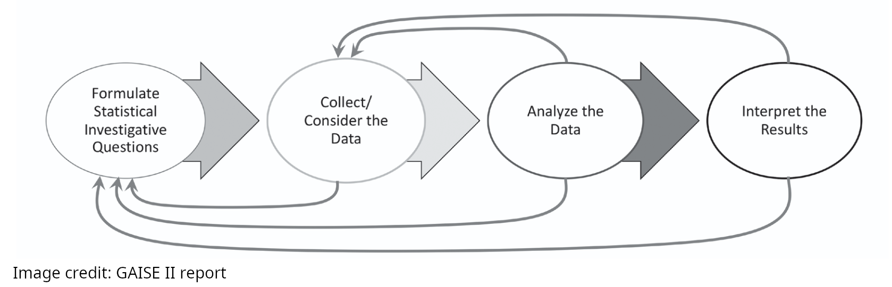
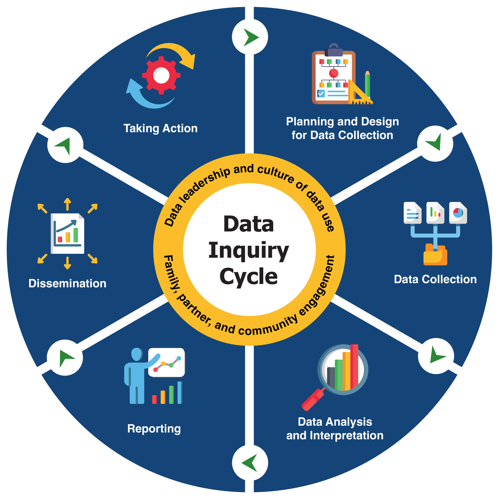
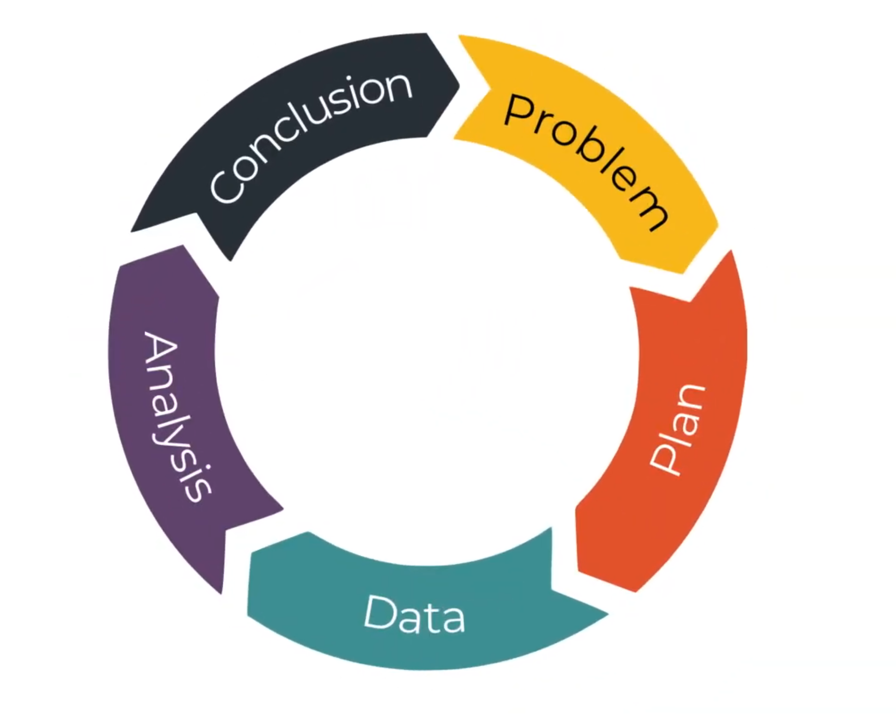
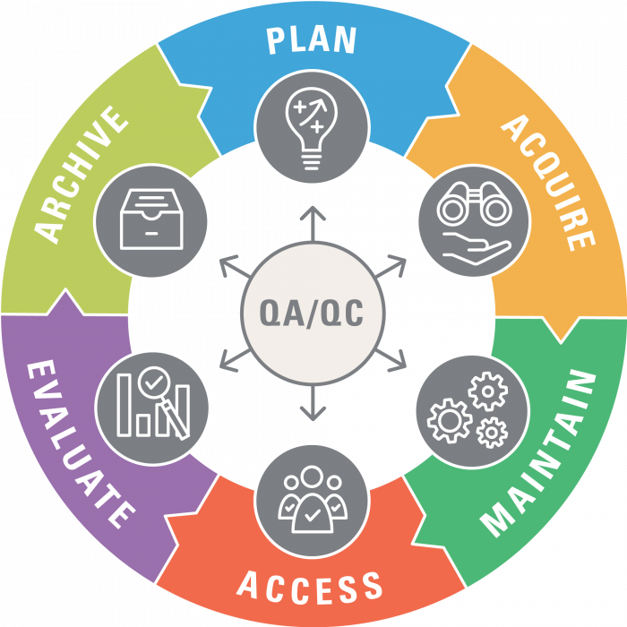

{width=100% fig-align="center"}

A key habit of scientifically-minded people is the data cycle

However, there is no universally agreed-upon definition of the data cycle, and not everyone even calls it the data cycle. So you and your class are going to define for yourselves what the "data cycle" involves

## The many definitions of "the data cycle"

There is no exact definition of the "data cycle". Go ahead and search on wikipedia for the data cycle and you won't find anything.

The figure at the top of this page is from a [report](https://www.amstat.org/asa/files/pdfs/GAISE/GAISEIIPreK-12_Full.pdf) that describes itself as "A framework for statistics and data science education" and in that report the figure shown above is labeled as the "Statistical problem-solving process". You can see in this figure that there are arrows that imply a sequence that begins with raising questions and working with data which starts over again.

Here is a different figure from a research group that studies data education. They call this "the Data Inquiry Cycle"

{height=400 fig-align="center"}

Image credit: [SRI international](https://dasycenter.org/data-inquiry-cycle/)

Here is yet another visualization, this time from a youtube channel called Digital Skills Education and they do call this ["the data cycle"](https://www.youtube.com/watch?v=O6aCho7carA)

{height=400 fig-align="center"}

Image credit: [Digital Skills Education](https://www.youtube.com/watch?v=O6aCho7carA)

And here is another interesting visualization which is described as the "Data Managment Life Cycle" that was developed by [U.S. Fish and Wildlife Services](https://www.fws.gov). Note that QA stands for Quality Assurance and QC stands for Quality Control

{height=350 fig-align="center"}

## The most important definition of "the data cycle" is your own

If you want you can do a [Google image search on "the data cycle"](https://www.google.com/search?sca_esv=a9219a81d345266f&udm=2&fbs=ABfTbFVyMZGZf1hfvX9uKjN_-G8c4u0nXx4bEIpwm1lnNH832VTJOOCxW_fyN-Q_ezyf8gKCPb62Sv4Y60wQDsMxJw_GUn1N2yN6o6cIH09xVUI5GL_0tqfbtAVzy9rZzU3mIopUAqZ4wel5f-RYFX5xtVMdIdyIj-pkKUUyY8TklLN58LLmsUeCEiYJPo7E13HzQ0pqdGFl_skouagXjFd5fVQWurPntg&q=the+data+cycle) and find dozens of examples of figures that visualize the habits of scientifically-minded people (like you and me!) as it relates to data

Eventually, you will see enough examples where you will feel like there are parts of the cycle that are important and parts that are not important. That's great! If you incorporated every aspect of the data cycle that you found on [Google Image Search](https://www.google.com/search?sca_esv=a9219a81d345266f&udm=2&fbs=ABfTbFVyMZGZf1hfvX9uKjN_-G8c4u0nXx4bEIpwm1lnNH832VTJOOCxW_fyN-Q_ezyf8gKCPb62Sv4Y60wQDsMxJw_GUn1N2yN6o6cIH09xVUI5GL_0tqfbtAVzy9rZzU3mIopUAqZ4wel5f-RYFX5xtVMdIdyIj-pkKUUyY8TklLN58LLmsUeCEiYJPo7E13HzQ0pqdGFl_skouagXjFd5fVQWurPntg&q=the+data+cycle) and put it one one diagram it would look like a mess and no sane person would approach data that way.

## The Big Task

<b>Imagine there was a question that you really cared about and there was data that was relevant to that question. What would the data cycle look like for you as you investigated that question?</b>

Here are some options to make your own data cycle

* Use Google slides (which has nice arrows and shapes)
* Use markers and paper or a whiteboard

Here are some questions to help break down the task

* How many steps are in your data cycle?
* What steps of the data cycle in the examples above do you feel like you can't live without
* Should we even call it "the data cycle"?
* Should it be in a circle?
* Should it be more like the figure at the [top](datacycle.html#top) of this page which has a cycle but there are also arrows to go back and repeat parts of the cylce before moving on?

<b>Print it out and put it up on the wall!</b> We are going to look at a lot of data, so this will be a helpful guide.