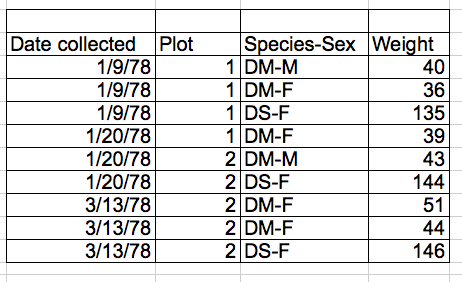

{width=600 fig-align=center}

This activity was developed by [Data Carpentry](https://datacarpentry.org/) and has been adapted for use by STEMcoding.

## Links to Activity
* [Activity Landing Page](../EcologyLesson/landing/index.qmd)