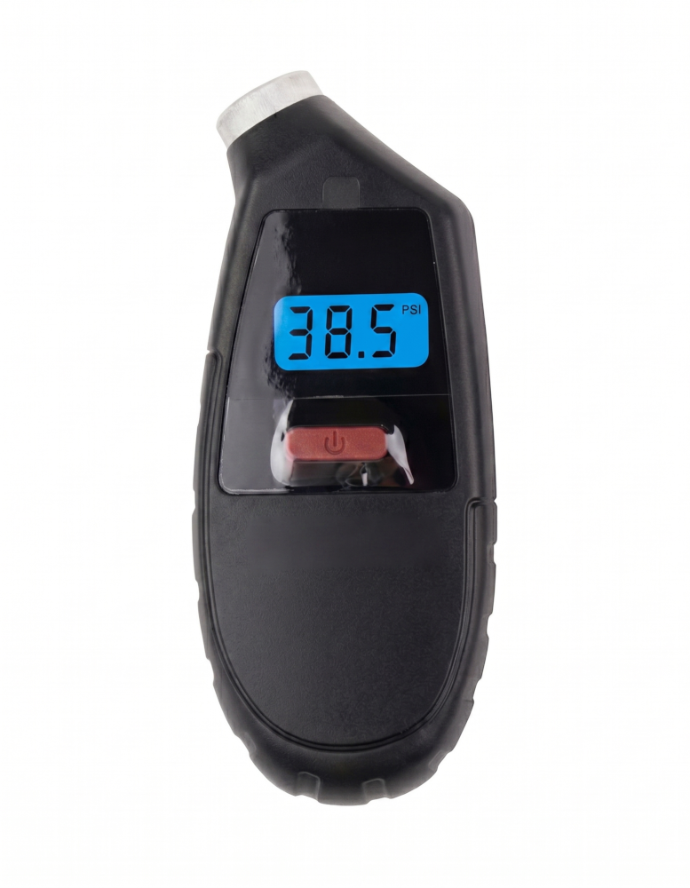
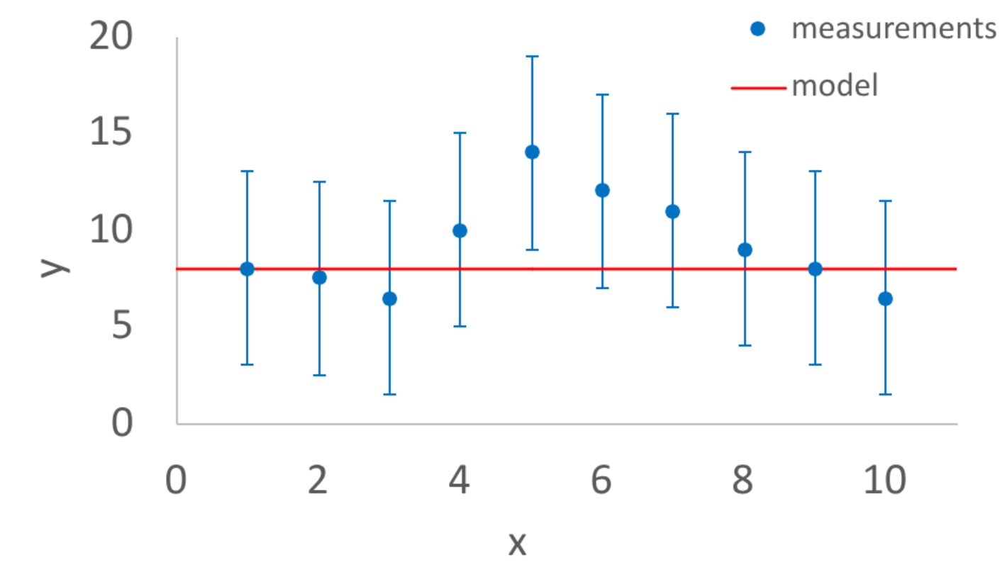
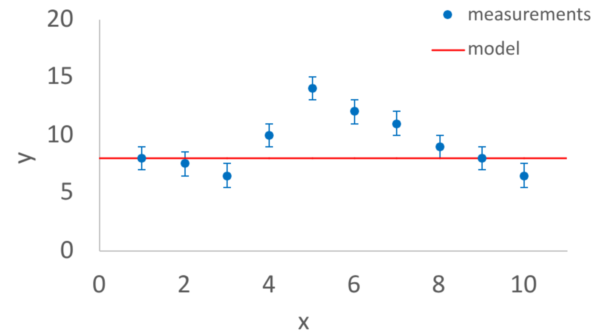

{height=300 fig-align="center"}

Error bars are great and why we are highly confident about it!

## Error Bars

Are you sure? How sure are you? These are two of the most important questions that human beings can ask. <b>An error bar is a visual representation of the uncertainty of some measurement.</b> In other words an error bar is a visual representation of how sure or how unsure you are about that measurement.

### Estimating uncertainty

Let's take an example of a measurement of the pressure in a car or a bike tire.

{height=400 fig-align="center"}

You can see in the image above that the tire pressure sensor is indicating 38.5 PSI which stands for pounds per square inch. This is a pretty typical value for the pressure of a car tire. It certainly seems like there is no error bar on this measurement. It's just 38.5 PSI. But if you think about it, because there are only three digits of precision shown, that says something about how precise the measurement is. It's not just 38.5 PSI. It is reasonable to conclude that the measurement is 38.5 PSI  +/- 0.05 PSI. In other words the measured value is 38.5 PSI but the uncertainty on that measurement is about 0.05 PSI. 

How did we get 0.05 PSI for the uncertainty? Well, if the measured value was 38.56 PSI then the device would probably round it to 38.6 PSI, or if the measured value was 38.44 PSI then the device might round it to 38.4 PSI. But it didn't, instead the value shown is 38.5 PSI. 

If we were measuring PSI for a science project, for example measuring the PSI of a tire or a ball versus temperature, for example, you could plot both the measured value (a dot) and show the uncertainty with an error bar (the thing that looks like an I). 

You can see from this example, that even in a situation where the uncertainty is not mentioned that we can infer what the uncertainty might be.

<b>Science fair tip:</b> 
A common mistake in science fair projects is to not estimate the  uncertainty or visualize that uncertainty with an error bar

### Why this matters

There are many reasons why error bars are important but here are a few salient ones:

<b>1. Error bars are important because it forces you the experimenter to think about your uncertainties</b>

If you are thinking about uncertainties before you do your experiment then you are probably going to do a much more careful experiment than you would without thinking about uncertainty at all or only thinking about uncertainty after the experiment was performed. Error bars are a visual reminder of this important habit of mind. 

<b>2. Error bars are important for data storytelling </b>

Stephanie Evergreen says in her book Effective Data Visualization that <b>“We visualize data to tell a story”</b>. Uncertainty is an important part of that story and error bars are a way to visualize that uncertainty. Sometimes the story you are telling is to yourself (I measured this and got these results and maybe this is why). Sometimes the story you are telling is to someone else (I measured this and got these results and I'm pretty sure this is why but tell me what you think). Either way, error bars are an important part of that story.

<b> 3. Anomalies </b>

In some ways the purpose of doing a science experiment is to identify anomalies. Anomalies are repeated measurements that disagree with a theoretical model that has worked well for other experiments. Scientists are always very interested in anomalies. Some anomalies are resolved by realizing that the measurements were flawed. Some anomalies are resolved by improving the theoretical model. Some anomalies have never been convincingly explained and maybe one of you reading this will be the person to resolve it!

<b>Error bars are EXTREMELY important for anomalies!</b> The only difference between the two plots below is that the size of the error bars are much larger on the left. 

  
  

With the plot on the left, there are measurements that disagree with the model but the error bars are large so the feeling is that the measurements and the model are still consistent with each other.

But with the plot on the right, even though the measurements are the same, the error bars are so small that it really seems like something is wrong with the model, or wrong with the measurements, or wrong with the error bars (specifically that the error bars are too small). It will take more work to figure out which of those three possibilities is the most important one. <b>If the disagreement remains then maybe you've made a discovery!</b> The detection of the Higgs Boson, which won the Nobel Prize in physics in 2013, involved results that looked a lot like the plot on the right.

### How much disagreement is a lot?

There is no strict rule about how different your measurements and the model need to be before its time to get excited. But there is a tradition in science that <b>if</b> the difference between your measurement and the model <b>divided by the uncertainty</b> is greater than five then maybe something really interesting is going on. This is often called the [5$\sigma$ threshold](https://cerncourier.com/a/five-sigma-revisited)

<b>Science tradition:</b> 
The 5$\sigma$ threshold is a tradition where scientists hesitate to declare that  a discovery has been made unless the measurements and the  model disagree by more than five times the uncertainty

An important detail is that the error bar visualizes the uncertainty both up and down. In other words the error bar shows the possibility both that the measured value could have been larger and the uncertainty that the measured value could have been smaller. We only need to divide by the uncertainty so you would divide the difference by <b>half</b> of the vertical height of the error bar.

To give a concrete example, earlier we discussed that a tire pressure gauge is measuring 38.5 PSI +/- 0.5 PSI. So if we visualized the error bar for that measurement it would be centered at 38.5 PSI and it would go up +0.5 PSI and down -0.5 PSI. The vertical height of the error bar would be 1.0 PSI. If we compared the 38.5 PSI measurement to some kind of model and there was a difference, we would divide that difference by 0.5 PSI (and not 1.0 PSI) to get an idea for how different the measurement is from the model.

