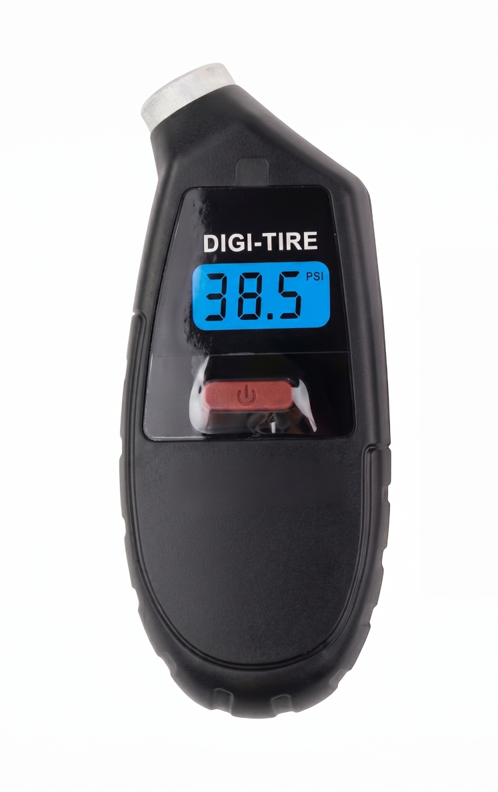

{height=300 fig-align="center"}

Error bars are great and why we are highly confident about it!

## Error Bars

Are you sure? How sure are you? These are two of the most important questions that human beings can ask. <b>An error bar is a visual representation of the uncertainty of some measurement.</b> In other words an error bar is a visual representation of how sure or how unsure you are about that measurement.

### Estimating uncertainty

Let's take an example of a measurement of the pressure in a car or a bike tire.

{height=400 fig-align="center"}

You can see in the image above that the tire pressure sensor is indicating 38.5 PSI which stands for pounds per square inch. This is a pretty typical value for the pressure of a car tire. It certainly seems like there is no error bar on this measurement. It's just 38.5 PSI. But if you think about it, because there are only three digits of precision shown, that says something about how precise the measurement is. It's not just 38.5 PSI. It is reasonable to conclude that the measurement is 38.5 PSI  +/- 0.05 PSI. In other words the measured value is 38.5 PSI but the uncertainty on that measurement is about 0.05 PSI. 

How did we get 0.05 PSI for the uncertainty? Well, if the measured value was 38.56 PSI then the device would probably round it to 38.6 PSI, or if the measured value was 38.44 PSI then the device might round it to 38.4 PSI. But it didn't, instead the value shown is 38.5 PSI. 

If we were measuring PSI for a science project, for example measuring the PSI of a tire or a ball versus temperature, for example, you could plot both the measured value (a dot) and show the uncertainty with an error bar (the thing that looks like an I). 

You can see from this example, that even in a situation where the uncertainty is not mentioned that we can infer what the uncertainty might be.

<b>Science fair tip:</b> 
A common mistake in science fair projects is to not estimate the uncertainty or visualize that uncertainty with an error bar

