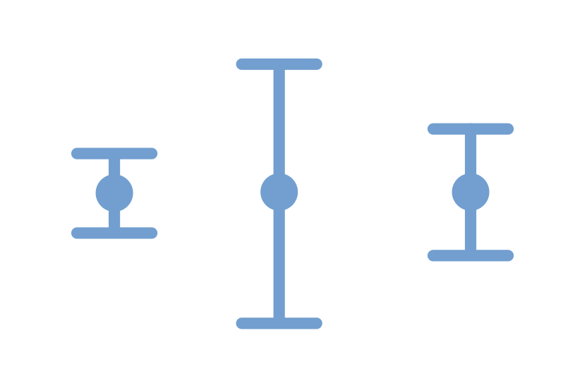

{height=300 fig-align="center"}

How big are my error bars? Let's talk about it

# Calculating error bars

In [Why we love error bars](errorbar1.html) we talked about a tire pressure sensor. The sensor shows three digits of precision on the pressure in PSI units. With some thought we can conclude that the uncertainty would be +/- 0.05 PSI because the uncertainty is the fourth digit that we can't see on the digital gauge. 

Another situation where the uncertainty is straightforward is when the user manual for the sensor you are using states the uncertainty. For example the CO2 sensor mentioned in other activities on our website is, according to its manual, only accurate to +/- 20 parts per million whereas the CO2 concentration measurement might be between 400 parts per million and 2000 parts per million depending on whether you are outside or inside in a crowded area.

<b>Key lesson:</b> 
Sometimes determining the uncertainty is as straightforward  as reading the user manual for the sensor

## Multiple measurements

It is always good to do multiple measurements! Everyone knows to take the average of those measurements but how do you figure out the error bar? 

A science fair project that many people do is inflate a soccer ball to different PSI pressure and then they do multiple trials of how far they can kick the ball. In these situations the uncertainty is not in the measurement tools. There is no reason to think that the distance the ball traveled was inaccurately measured.

The key question here is whether the <em> average</em> distance changes with PSI pressure. For each value of PSI for the ball, the error bar we are interested in is the uncertainty on the measured average distance. In science we call this “the error on the mean” or “the standard error”.

## How to calculate the error on the mean

If you have multiple trials with THE SAME CONDITIONS (in the example the same PSI) then you can calculate the error on the mean as follows:

* Calculate the mean of all the trials
* For each trial, subtract that specific number from the mean you just calculated. Take that result and square it.
* Do this step of subtracting the result of each trial from the mean and square it for all your meausrements.
* Take all of these values where you have subtracted the measurement and the mean and squared it and add them all together.
* Take the result of that adding these values together and divide by the number of measurements 
* Take the result from dividing by the number of measurements and take the square root

<b>Done!</b> You have calculated the error on the mean (a.k.a. [the standard error](https://youtu.be/Vm1NcJuJeeY?si=oBoA21bTB030B9Ix))

Bear in mind that you <b>only do this when the conditions are the same</b>. In the soccer ball example you would not combine results from different PSI when you do the calculation above because different PSI means different conditions.

### Task: Example data

Let's take the example of kicking the soccer ball. We try to kick it with the same effort for ten kicks and the measured distance comes out like this:

35 feet, 39 feet, 40 feet, 42 feet, 37 feet, 34 feet, 41 feet, 35 feet, 36 feet, 40 feet

The average distance would be 37.9 feet.

If you do the procedure in the previous section and take the measurement minus the average and square it and do that for each number and add it all up you would get 72.9. Then divide by the number of measurements which is 10 so then you have 7.29 and then take the square root which would give 2.7 feet.

So the average distance would be 37.9 feet +/- 2.7 feet, which seems resonable given that the range of values is from 34 feet to 42 feet and that we only did 10 trials. Specifically the uncertainty of 2.7 feet is the uncertainty "on the mean"

Here is another set of data -- let's say that your friend kicked the ball and they can kick further than you. Here is the data:

45 feet, 47 feet, 38 feet, 39 feet, 47 feet, 51 feet, 40 feet, 41 feet, 46 feet, 50 feet

<b> Verify that the average distance</b> is 44.4 feet with an uncertainty on the mean of +/- 4.4 feet

<b>Generate a set of measurements (just make up some data!) and calculate the mean and the uncertainty</b> and give them to your friend to see that you came up with the same values

## Things to notice

Because we are dividing by the number of measurements, as we do more measurements the error on the mean (a.k.a. [standard error](https://youtu.be/Vm1NcJuJeeY?si=oBoA21bTB030B9Ix)) should decrease, which makes sense because as we do more trials the mean from all those trials should get more and more accurate.

That is why, if you do have an opportunity to work on a research project in college, and you show your advisor a result that disagrees with an established model, they are likely to tell you to do more trials!

## Advanced

What we have done is obtained the error bar from the measurements rather than obtaining the error bar from our knowledge of the measurement methods we are using. This is not the only way to obtain error bars from the measured data. Another more complicated approach is called “bootstrapping”.

Another related situation is when you are shopping on a site like Amazon and you see a seller that has 5/5 stars but only 10 reviews, and another seller that is 4.8/5 stars with 50 reviews and another with 4.65/5 stars with 200 reviews. This is addressed in an [excellent video](https://www.youtube.com/watch?v=8idr1WZ1A7Q) by 3Blue1Brown. In that video he provides some math to back up what most of us already know which is that a 100% rating with only 10 reviews is not very impressive (because with so few reviews the error on the mean is very large). 
