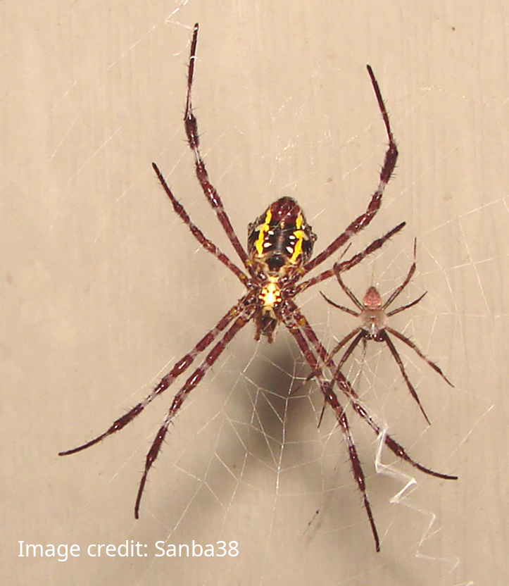

[{fig-align="center" height=400}](https://commons.wikimedia.org/wiki/File:Male_and_female_A._appensa.jpg)

In some species, the males have a different average size than the females

# Animal dimorphism

The image above shows an example of size dimorphism in the spider species <i>Argiope appensa</i>. On the left is the female and on the right is the male. As you can see there the female (left) is much larger than the male (right).

There are many species where the females are larger than the males (ex. cicadas, some species of Octopus), and there are many examples of species where the males are larger than the females (ex. lions, elephant seals, Orangutangs). In humans, for example, males are on average 7% taller than females. There are, of course, many examples of females who are taller than the average height of males and males who are shorter than the average height of females, but <i>on average</i> men tend to be 7% taller than women.

In some species, like the <i>Argiope appensa</i> spider, the difference is pretty big whereas other species (like cicadas or humans) the difference is not as large as that. <b>How big or how small the difference in average sizes between male and female tells you something interesting about that species and their life cycle!</b> So if there was a new species discovered we would want to know what the size difference was and whether males or females tend to be larger on average.

## The problem

If a new species has been discovered we might only have a few specimens to determine the average sizes. If we have at least one male and at least one female we can estimate the difference in average sizes, but <b>how do we know if the few individuals we have to measure are unusually large or small?</b>

## Solution: Calculate the error on the mean

We discussed this exact situation in [Are my error bars big or small?](errorbar2.html). Specifically we discussed situations where we have some number of trials and we need to know not just the average value, but we also need to know the uncertainty in the average value (a.k.a. the error on the mean). Here is the procedure that we discussed where we have replaced measuring tire PSI with measuring animal sizes:

If you have multiple specimens that are either all male or all female then you can calculate the error on the mean as follows:

* Calculate the mean of all the male specimens (later do all these steps again for all the female specimens)
* For each specimen, subtract that specific size from the mean you just calculated. Take that result and square it.
* Do this step of subtracting the result of each specimen size from the mean and square it for all your meausrements
* Take all of these values where you have subtracted the measurement and the mean and squared it and add them all together
* Take the result of that adding these values together and divide by the number of measurements 
* Take the result from dividing by the number of measurements and take the square root

<b>Done!</b> You have calculated the error on the mean! If you just did this calculation for the male specimens, now do the calculation for the female specimens!

## New species: Vermicious Knids

Let's imagine that in the forest someone has stumbled across 8 individuals of a new species called Vermicious Knids (which is a totally fictional name). If you click the button below, it will save a CSV file that you can load into a spreadsheet with information about these 8 individuals. The data has two columns: One for Male or Female, and the other for size. You can assume that the size is in centimeters.

  <button id="download-knids-btn">Download Vermicious Knids Data</button>

Note that your data from clicking the button above will be different from other people's data and that's ok.

### Task: Calculate the average size and the error on the mean

There are only 8 rows in the data set. Separate the data into male and female (for example using different tabs in the spreadsheet or different parts of he spreadsheet). Then go ahead and calculate the mean, and then calculate the error on the mean by following the directions in the previous sections.

Here are some questions to consider:

* Is there a size difference between male and female with Vermicious Knids? 
* If yes, are the males larger or the females larger and by how much? 
* Based on your result for the error on the mean, is it possible that the size difference can be explained by having so few individuals to measure?

## Two new species: Snozzwanglers and Hornswagglers

There are now three new species: Vermicious Knids, Snozzwanglers and Hornswagglers. Obviously these are all fictional names. You can click on the link below to open up a new window where you can download data about these species. The species are not related so the average size difference between male and female should be treated separately for each species.

<a href="../dimorphism2.html" target="_blank">Click here to download data about all three species in a new tab</a>

 

In the link above, you can specify how many individuals of a particular species that you would like. But <b>in real life it would be quite an effort to find 10,000 examples of a brand new species.</b> So think about how many examples you might actually need.

Here are some questions to answer for all three species:

* Which is larger on average? Male or female?
* How much bigger or smaller are male or female individuals on average?
* What is the minimum number of individuals that you would recommend be measured in order to feel like the conclusions about the average size were not being affected by having a small number of measurements.

### Advice

There are a couple of ways to accomplish these tasks. Generally the biggest challenge will be dealing with the larger datasets and separating the male rows from the female rows.

One way (but not the only way) to separate the male rows from the female rows would be to highlight all the data and click "Sort" and then select a Sort on Column A because Column A will be where it says M or F.

