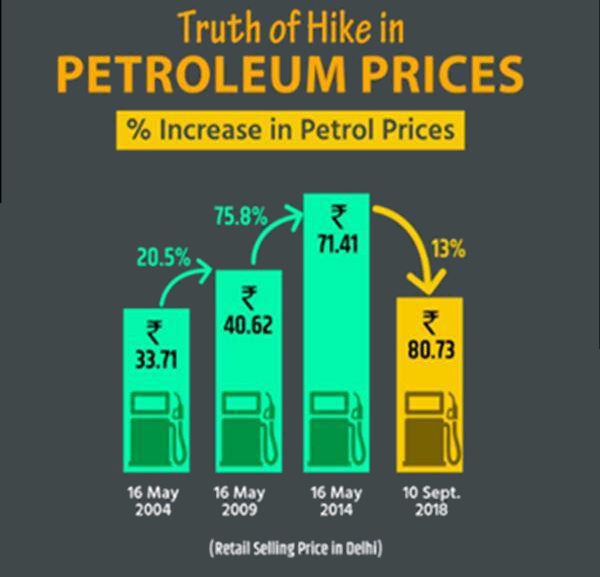

{width=400 fig-align="center"}

## Central Question:

What makes for a good figure? What makes for a bad figure? Let's look at some examples and discuss

[Examples of Bad Figures](https://drive.google.com/drive/folders/1R98A9Yb05nGeDlbopWS-5gkxLOhGfCNA?usp=sharing)

[More examples of Bad Figures from viz.wtf](https://viz.wtf/archive)

[Examples of Good Figures](https://drive.google.com/drive/folders/1KnYEHMgyHlh0SMfzkC2VQ6WsyY6TGgqM?usp=sharing)

### Other resources

[New York Times What's Going on in this Graph](https://www.nytimes.com/column/whats-going-on-in-this-graph)

[New York Times What's Going on in this Graph (Suggestions for Teachers)](https://www.nytimes.com/2023/07/26/learning/over-75-new-york-times-graphs-for-students-to-analyze.html)

[The Visual Capitalist](https://www.visualcapitalist.com)

[Effective Data Visualization (Book) by Stephanie Evergreen](https://play.google.com/store/books/details/Stephanie_D_H_Evergreen_Effective_Data_Visualizati?id=ilWKDwAAQBAJ&hl=en_US)