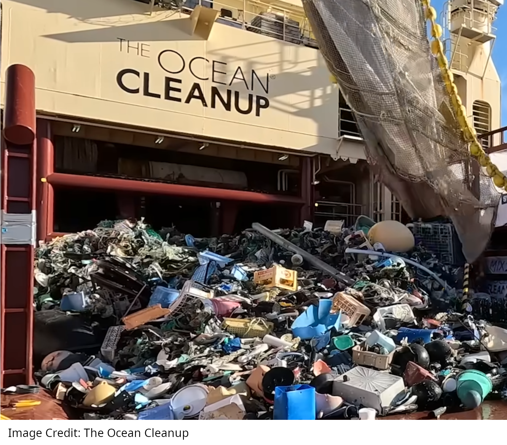

{width=500 fig-align=center}

Why does trash in the Great Pacific Garbage Patch just keep swirling around and around instead of landing on a beach somewhere?

## Background information

Ever since there were humans, there was garbage left behind by humans. Some of that garbage would get into rivers which would take it out to the oceans.

What is different in our age is (1) there are a lot of humans -- over [eight billion](https://www.census.gov/popclock/world), and (2) a lot of the garbage that we produce is in the form of plastic. This latter fact is important because any material that has a <i>lower</i> density than water will float.

<b>Key science fact:</b> 
Any material with a lower density than water will float

### Density

The density of a material is a measure of how much mass there is compared to how much volume there is of that material. For example, styrofoam is a low density material because you can have a lot of syrofoam and is not very heavy. So its mass is small compared to its volume. Whereas lead or gold are high density materials because one brick of lead or gold would be very heavy. So its mass is large compared to its volume.

In general, density ($\rho$) is the ratio of the mass of an object to the volume of that object.

$$ \rho = \frac{m}{V} $$

We use the symbol $\rho$ to represent the density. It looks like the letter p but it is actually a greek symbol that is pronounced ["rho" or "row"](https://upload.wikimedia.org/wikipedia/commons/transcoded/d/d7/LL-Q1860_%28eng%29-Flame%2C_not_lame-Rho.wav/LL-Q1860_%28eng%29-Flame%2C_not_lame-Rho.wav.mp3). Objects of a particular material will generally have the same density of other objects made from that material. Density can be reported in terms of grams per cubic centimeter (g/cm3), grams per milliLiter (g/mL), or kilograms per meter cubed (kg/m3). Grams per cubic centimeter and grams per cubic milliLiter are the same because a cubic centimeter is the same volume as a milliLiter.

Fresh water has a density of 1 gram per cubic centimeter (1 gram per milliLiter)while sea water has a density of 1.02 grams per cubic centimeter (1.02 grams per milliLiter).

<b>Key science fact:</b> 
The density of fresh water is 1 gram per cubic centimter

Many plastics have a density less than this. According to [this pdf](Plastic-Density-Table.pdf), which was fact checked by the Monterey Bay Aquarium foundation, many plastics have a density in the range of 0.9 grams per cubic centimeter to 0.96 grams per cubic centimeter. These plastics will therefore float in water unless it is attached to a denser material like a metal. Most metals have significantly [larger densities](https://www.engineersedge.com/materials/densities_of_metals_and_elements_table_13976.htm) than water. For example, aluminum is one of the least dense metals and it is still almost three times denser than water. Consequently, metals tend to sink.

## The Great Pacific Garbage Patch

It turns out that ocean currents often have a circulating pattern which is called a ["gyre"](https://www.merriam-webster.com/dictionary/gyre).   In the 1990s scientists and boaters began to notice that floating plastic trash was strewn throughout a large area of the Pacific Ocean called the [North Pacific gyre](https://en.wikipedia.org/wiki/North_Pacific_Gyre). Groups like [The Ocean Cleanup](https://www.youtube.com/@theoceancleanup/videos) are working to remove the trash but it remains a problem and there are "microplastics" that are difficult to remove with nets.

What is interesting and not particularly obvious is that floating garbage would collect in the North Pacific gyre and stay there for decades or more.  Think about an individual piece of floating trash in the Great Pacific Garbage Patch. Why doesn't this trash end up on a beach somewhere after a year or two, or three? <b>This is something that a p5.js computer simulation can help us understand!</b>
(Note: sometimes trash from the Great Pacific Garbage patch does end up on a beach but it is rare and most of the trash just floats there year after year.)

<iframe width="100%" height="445" src="https://editor.p5js.org/ChrisOrban/full/K9YEn7ru-"></iframe>

The simulation above contains a mathematical model for an ocean gyre that comes from [Section 6 of this research paper](gyre_model.pdf). The little white dots are supposed to be pieces of garbage. The black arrows show the direction of ocean currents.
It's not important that you understand the model or the paper. What is important is that the simulation above includes this code:

<pre>
x[i] += vx(x[i],y[i],t)*dt;
y[i] += vy(x[i],y[i],t)*dt;
</pre>

which is a very fancy version of the code below which you might recognize from [Move the blob](movetheblob.html) or many of the other [p5.js Physics of Video games activities](../activities.html#category=Javascript)

<pre>
 x += vx*dt;
 y += vy*dt;
</pre>

In the simulation above, (x,y) is the position of a piece of garbage. That position changes according to the velocity of the ocean currents in the x direction (<code>vx</code>) and in the y direction (<code>vy</code>) multiplied by the time during each step (<code>dt</code>)

<b>THE IMPORTANT THING IS THAT THE LITTLE WHITE PIECES OF TRASH KEEP CIRCULATING!!!</b> There is actually some code in the simulation that checks if the piece of trash leaves the rectangle, then don't let it come back. But, remarkably,  if you run the simulation for a long time and maybe one piece of trash out of 100 will leave the simulation and not come back. This is true even though the ocean currents are changing with time as you can see from the changing arrows!

Interestingly, it only takes some simple code to update the x and y position of the trash to come to this conclusion. Sometimes a little bit of code can answer questions that would otherwise be very difficult to answer!

## Questions to consider

What do you think about the approach of [The Ocean Cleanup](https://www.youtube.com/@theoceancleanup/videos) to remove trash from the oceans? What have been the difficulties they have run into? What is their approach now? What ideas do you have to remove or otherwise prevent trash from accumulating in the oceans?

Understanding ocean currents saves lives! Listen to [this podcast about Art Allen](https://omny.fm/shows/against-the-rules-with-michael-lewis/the-art-of-the-untold-story) who developed a computer program for the US Coast Guard that is used in emergencies when people fall off of a boat or a ship so that rescuers can anticipate the location of a person who is floating in the water. Thanks to his work, many people have been saved who would otherwise have been lost at sea. As a society, are we doing enough to celebrate people like Art? What is a life or death issue in our society that would benefit from the kind of careful technical work that Art did? 
What is another example of how basic scientific understanding (like research on ocean currents)  ultimately benefits our lives even if that was not the original goal?

### Advanced Questions

Look at the [code that is running the simulation](https://editor.p5js.org/ChrisOrban/full/K9YEn7ru-). How much of it can you make sense of? Which parts are you unable to make sense of? Can you simplify the code or make its syntax easier for another student to understand?

Look at Section 6 of the [research paper where the model for the gyre is presented](gyre_model.pdf). Do the plots in that section look familiar? How much of the model (Equations 71 - 76) contains math that you have seen before? If we didn't have a computer, Equation 77 would be all we have to explain why trash just keeps circulating. What does the research paper say about Equation 77 and what Equation 77 concludes?