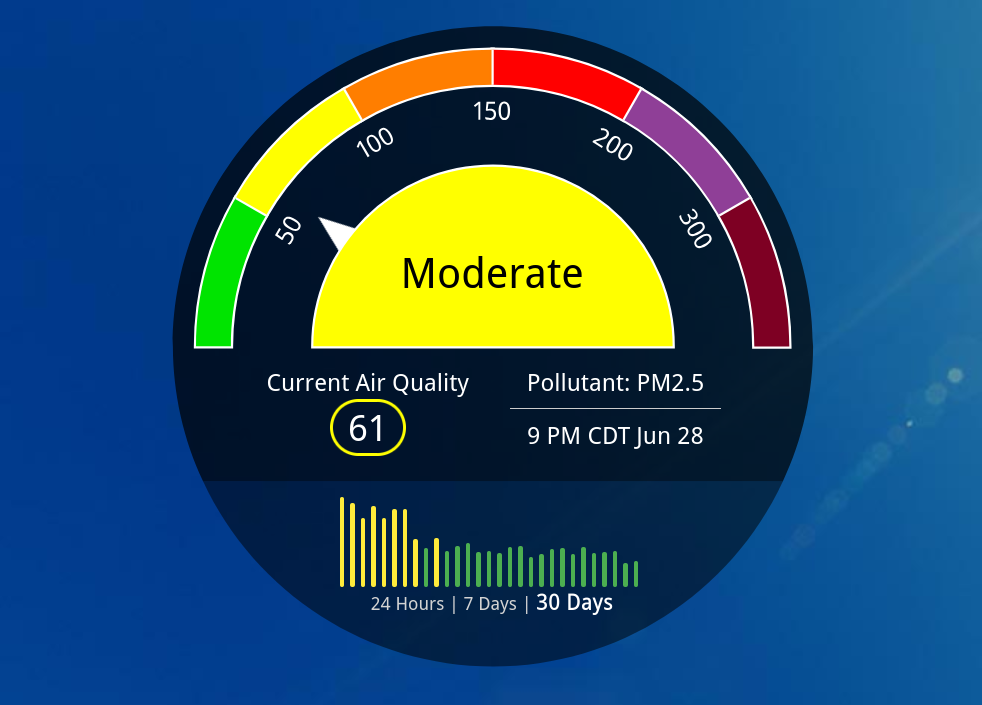
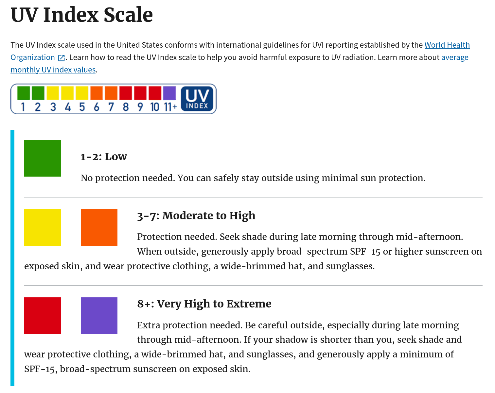

{height=300 fig-align="center"}

How can we help humans make decisions based on data and how to design systems that communicate dangers?

## What is an "index"?

In the context of public health, an "index" is a mathematical system that is designed to indicate the level of risk to human health. Two examples that we will focus on are the Air Quality Index (AQI) and the UV index. The risk in those cases is simple: bad air quality can damage your lungs or make you sick, and significant ultraviolet (UV) rays can give you a sun burn or possibly skin cancer.

<b>Important detail:</b> 
The AQI and the UV index are <i>communicating</i> risk which means  that they are one part science and one part human element

The image at the top of the page shows air quality information for a particular town. The Air Quality Index is 61 out of a scale of 500, and you can see there that this is outside of the green zone where the air quality is reasonably good. You could say that going outside in that town and breathing the air on this day involves "moderate" risk. And you might consider wearing a disposable face mask like the kind you can buy from a drug store.

The UV index is not shown on the image at the top of the page, but it is simple to explain. The UV index is on a scale from 0 to 11 as explained in the image below from the US EPA

{height=475 fig-align="center"}

As you can see, the UV index provides clear advice on whether sunscreen is necessary.

## Why reporting scientific measurements isn't enough

When you design an index your goal is to communicate. A scientific measurement by itself may not do a great job of communicating the health risk.

Here are some examples of scientific measurements that are <b>not</b> very helpful or memorable:

* The total irradiance of UV light today is 3 W/m2
* The density of dust in the air with a diameter less than 2.5 micrometers is 50 $\mu$g/m3
* The ground level Ozone concentration is 68 parts per billion

All three of these examples represent <b>significant</b> risks to human health, but when you just read them aloud it does not really communicate a sense of danger. 

## Designing an index

There is no universally agreed upon right way of making an index but here are some characteristics of an index

* There is a range of values with some maximum and minimum (for example AQI is from 0 - 500 while UV index is from 0 to 11)
* Usually the value reported is an integer
* Higher values indicate more danger
* The value is related to one or more sources of danger or pollution
* The value increases and decreases appropriately to indicate how the risk or danger or pollution has changed (in other words, the value is not nearly always high and not nearly always low)

That last bullet point is a little bit like the story of the boy who cried wolf. For example, if the UV index was designed to be 10 nearly all the time, few people would care if it reached 11 even if 11 meant significantly more risk than 10. Likewise if the UV index was designed to be typically 0 or 1, people might not be too worried with a 2 even if that meant significantly more UV exposure. In designing an index, you want the number to change by a lot if the danger has changed by a lot. That is what is meant in the bullet point above which says "The value increases or decreases appropriately" to the danger.

## Two examples: AQI and UV index

Let's talk about how the AQI and the UV index indicate danger, starting with the UV index.

### UV index

Calculating the UV index involves a [series of steps](https://en.wikipedia.org/wiki/Ultraviolet_index#Technical_definition) but ultimately it boils down to this:

$$ {\rm UV \, index} = ({\rm Intensity \, of \, UV \, light \, from \, the \, sun}) \cdot ({\rm constant}) $$

The people that created the UV index could have chosen that constant to be whatever they wanted. And they decided to use a constant so that the UV index ranges from 0 to 11 where 11 corresponds to the typical highest intensity UV light that occurs on the surface of the earth during the course of a year.

### Air Quality Index (AQI)

The AQI is different from the UV index in that there are multiple scientific measurements that go into the AQI.

Here are the scientific measurements that are used to calculate the AQI

* Two measurements of how much dust or exhaust there is in the air called PM2.5 and PM10
* Ground level Ozone 
* Carbon monoxide
* Nitrogen dioxide
* Sulfur dioxide

In most cities the PM2.5 and PM10 are the most significant cause for concern, but if you live close to a factory it may be one of the other items there that are the biggest concern for air quality. Another reason for air quality to be poor is smoke from a fire.

Part of why the AQI was created is that there is a lot of information here about the quality of the air that needs to be summarized. Without the AQI you would have to remember what the danger values for five different quantities. Or maybe there would be an indicator like the picture at the very top of this page for all five, and you might still be overwhelmed by that information.

The AQI solves this problem by deciding on a danger range for each of the scientific measurements, then the measured value for each item is compared to that range and a number assigned. Of all of the items on that list, whichever has the highest number is determined to be the AQI.

## Life is full of choices

The AQI is determined by the item of most concern. This is an interesting choice because you might have high levels of dust/exhaust AND high levels of Ozone but if the dust is judged to be of higher concern then the AQI number comes from the dust ONLY. Having high levels of dust AND Ozone has the same AQI as having high levels of dust and no Ozone at all.

Do you agree with this choice? What other ways could they have designed the AQI for situations like this?
 