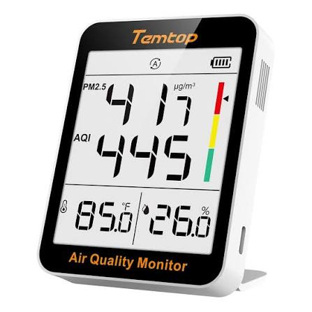

{width=400 fig-align="center"}

Take some sensors and explore your building

## Sensors

We recommend two affordable sensors and one measurement you can make with a smartphone

* We recommend the [Temtop home CO2 air quality sensor](https://temtopus.com/collections/temtop-co2-monitor/products/temtop-c1-co2-monitor-indoor-air-quality-monitor-portable-co2-detector-co2-temperature-humidity-home-office-or-school) or similar
* We recommend the [Temtop home PM2.5](https://temtopus.com/products/temtop-s1-indoor-air-quality-monitor-aqi-pm2-5-temperature-humidity-detector-for-home-office-or-school) or similar
* You can measure Sound levels in Decibels using a smartphone or tablet with [Arduino Science Journal](https://www.arduino.cc/education/science-journal)

Note: If you don't have a CO2 sensor and you just need data for your students to use here is a [Random CO2 data generator with p5.js](https://editor.p5js.org/ChrisOrban/sketches/M0iRTK6_x) that will save the data from a random number generator to a CSV file if you press spacebar

## Task #1. Create a spreadsheet and collect the data

In a spreadsheet make a list of rooms in your building. We are interested in the CO2 levels in each room, the particulate levels measured by PM2.5 (or the Air Quality Index which is derived from the PM2.5), and the sound levels. Maybe we are trying to select a room for a special meeting, or we are just curious about which classrooms are quieter and have better ventilation.

Before collecting data please read through this [Google Slide Deck](http://go.osu.edu/co2) about CO2 and why it is a useful thing to measure, even though CO2 is an inert gas that does not harm people (which is why we use it in carbonated bevarages for example).

Collect data from the three sensors in each room and fill in the table in the spreadsheet with your results. Each room is a row and each sensor is a column.

## Task #2. Spreadsheet skills

In the bottom left of the spreadsheet there should be a little + button to create a new sheet within your spreadsheet. This is kind of like creating a new tab except that the tab is a spreadsheet. <b>Create three new tabs, one for each of the sensors.</b>

Instead of making a list of rooms with measurements as different columns, take each new sheet and write down the rooms in a pattern that makes sense for your building. To fill in the data into this sheet DO NOT just enter the numbers again. Insead use a "cross-sheet reference" like in [this video](https://www.youtube.com/watch?v=F5Y9cuTb5Iw). Ultimately you will want to write things like <code>=Sheet1!A1</code> to get the values from the first sheet into the other sheets. To accomplish the same task, you can also click a cell in Sheet1 and presss Control + C and then go to the next sheet and click a cell and press Control + V.

## Thresholds for the sensor results

The CO2 and PM2.5 sensors both have a specific range for what is "good" (labeled as green), "fair" (labeled as yellow) and "poor" (labeled as red) air quality.

The CO2 sensor labels 0 - 1000 ppm as good (green), 1001 - 1500 ppm as fair (yellow), and 1501 ppm and above as poor.

The PM2.5 sensor labels 0 - 12 $\mu$g/m$^3$ as good (green), 12.1 - 55.4 $\mu$g/m$^3$ as fair (yellow) and greater than 55.5 $\mu$g/m$^3$ as poor (red).

There is no universally adopted range what is considered good, fair and poor sound intensity, but most references would definitely label > 120 decibels as dangerously high for human hearing, and arguably the threshold should be lower than that (perhaps > 110 decibels would make more sense). It is up to you to decide!

## Task #3. Conditional formatting

We want each cell with a measurement in it to light up with the color that corresponds to what the sensor would indicate (as discussed in the previous section).

In principle you could click each cell and click to assign a color to it to indicate how safe or concerning each value is. But it would be better if the color could be assigned automatically. Good news: there is a spreadsheet function called "conditional formatting" that can do this in both [Excel](https://www.w3schools.com/excel/excel_conditional_formatting.php) and [Google Sheets](https://support.google.com/docs/answer/78413)

Use conditional formatting so that the values turn the same color as the indicators.

For sound just make your own judgement about what would make sense, as discussed in the previous section.

## Interesting article

* Virus transmission is a concern for national and international conferences. In 2025, a conference set up a sophisticated system for monitoring CO2 as discussed in an article at [this link](https://www.wired.com/story/this-hacker-conference-installed-a-literal-anti-virus-monitoring-system/). If the link is broken you can download [this pdf](co2_conference.pdf)