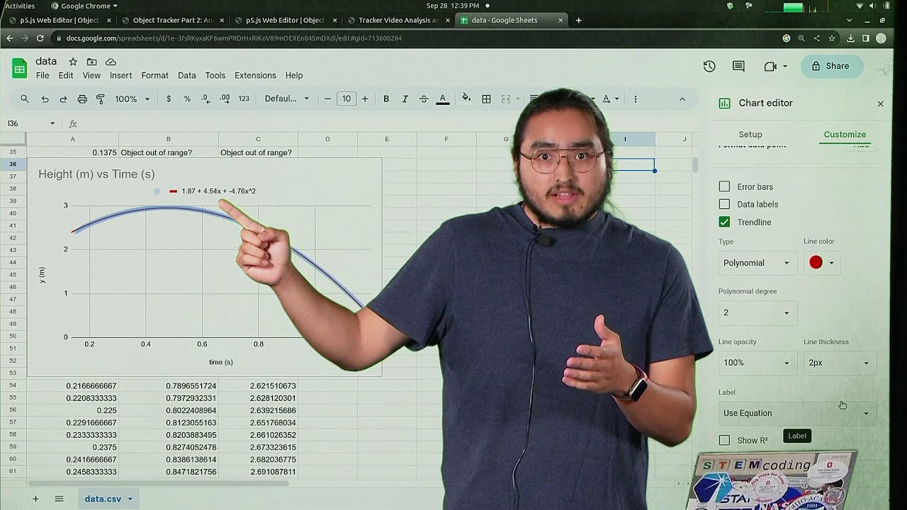

Now you can record your own direct measurement videos and analyze them with p5.js.

Note: The STEMcoding Object Tracker works best in chrome and edge!

It can work in other browsers (safari, firefox, etc.) but it may run slower or not at all due to some memory problems.

## Links to Activity

### Part 1: Track the Object
* [Instructions for Part 1](https://www.asc.ohio-state.edu/orban.14/stemcoding/datascience/objecttracker/part1/)
* [Part 1 Code Editor](http://go.osu.edu/objecttracker)

### Part 2: Analyze Height vs. Time
* [Instructions for Part 2](https://www.asc.ohio-state.edu/orban.14/stemcoding/datascience/objecttracker/part2/)

### Part 3: Analyze Velocity vs. Time
* [Instructions for Part 3](https://www.asc.ohio-state.edu/orban.14/stemcoding/datascience/objecttracker/part3/)

## Object Tracker Playlist

[Object Tracker Video Playlist on the STEMcoding youtube channel](https://www.youtube.com/playlist?list=PLISRe8GegO8SpJkhkIp3OpC-0bDucCdbd)

