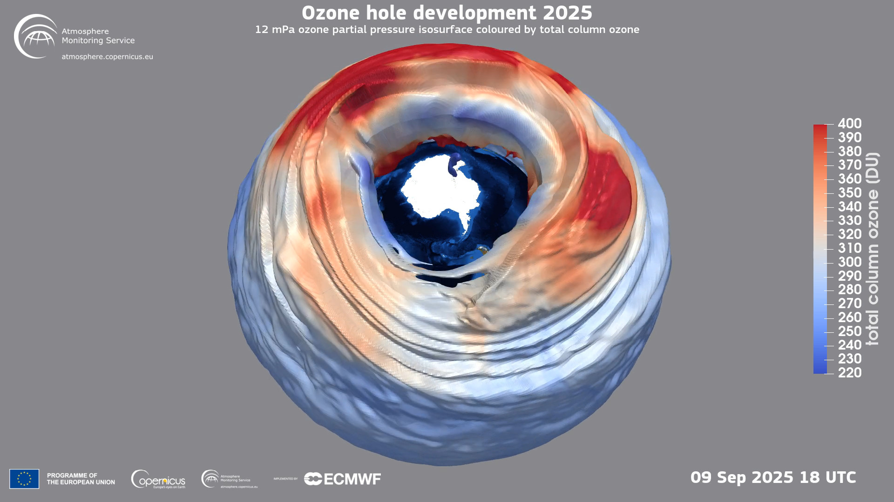
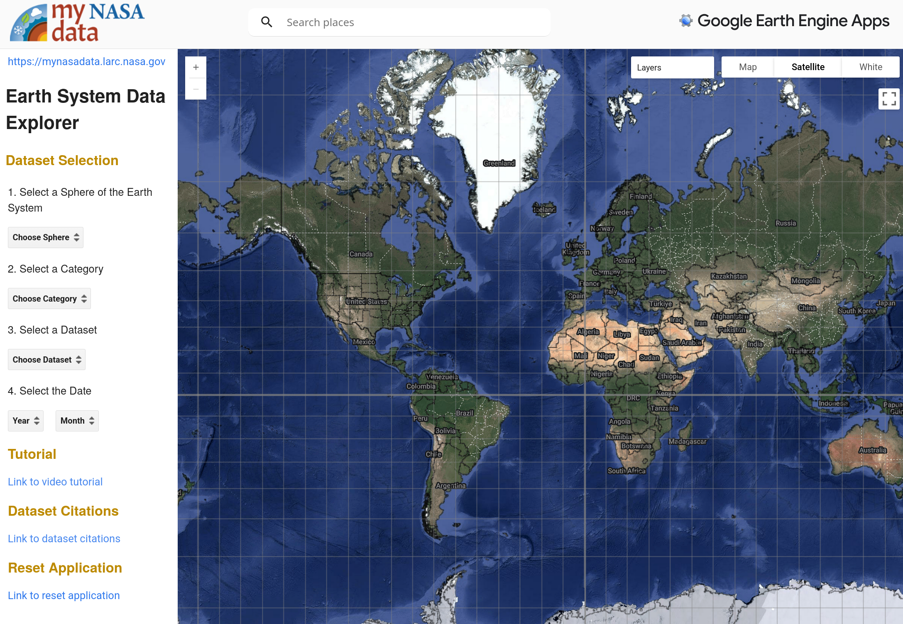
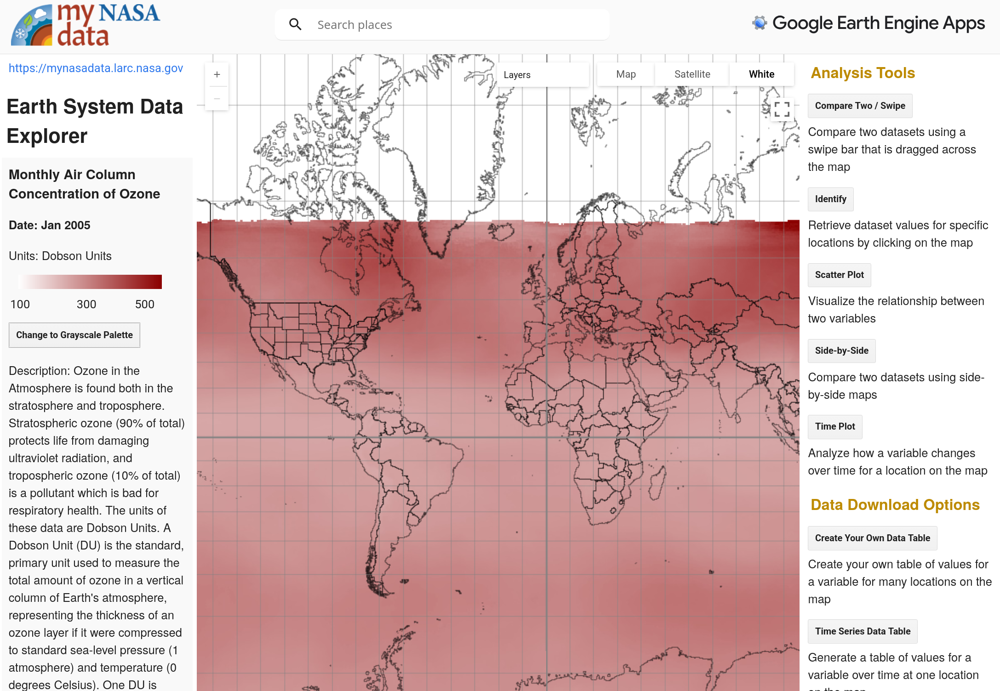
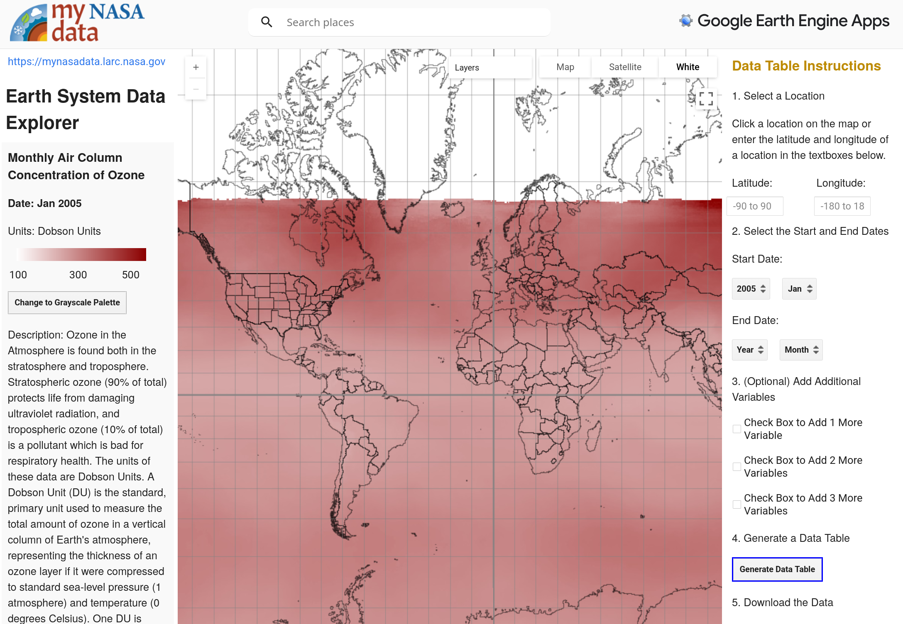
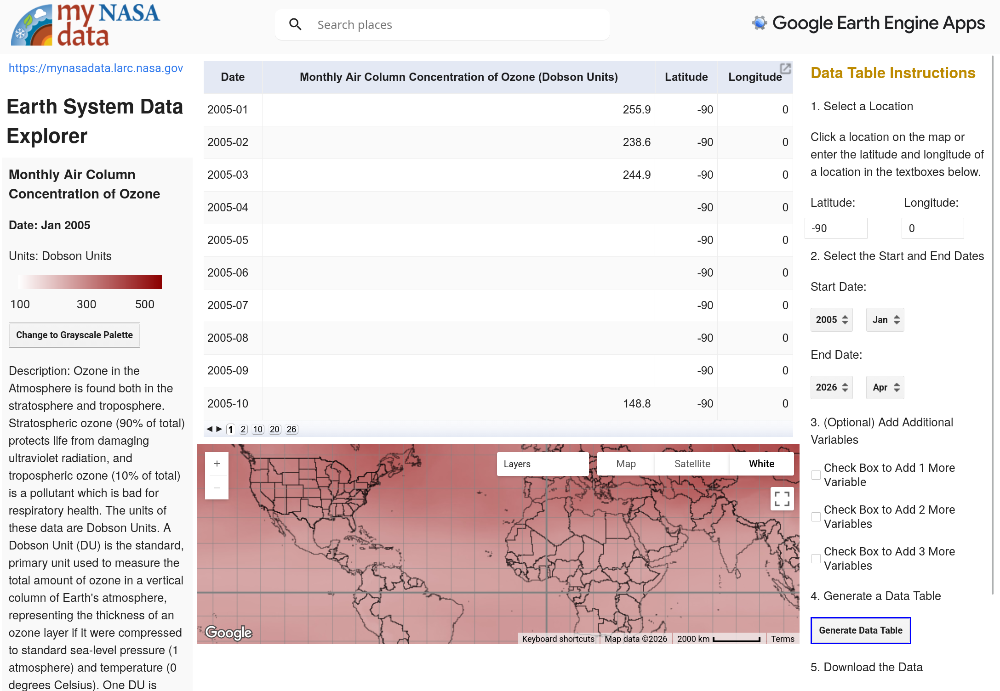
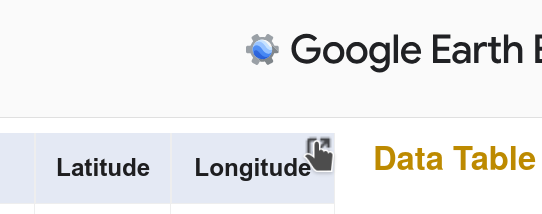

{height=300 fig-align="center"}

Is the Ozone layer recovering? Let's look at the data to find out!

Our goal today (Part 1) is to obtain Ozone concentration data above the South Pole from the NASA Earth System Data Explorer. 

## Step 1. Geek out on the Ozone layer

There are some great websites and youtube videos to learn about the Ozone layer. Take some time to check it out before we get down to business. Be curious!

* [NASA Ozone watch](https://ozonewatch.gsfc.nasa.gov)
* [European Union Ozone monitoring (which frankly is cooler-looking than the NASA Ozone watch)](https://atmosphere.copernicus.eu/monitoring-ozone-layer)
* [Wikipedia page for the Ozone layer](https://en.wikipedia.org/wiki/Ozone_layer)
* [(Youtube Video from NASA) Ozone 101: What is the Ozone Hole?](https://www.youtube.com/watch?v=Q15t5NQ1Aik)

## Basic facts about the Ozone layer

* Ozone is the chemical name for when three Oxygen atoms become bonded together to form a molecule, which is why the chemical symbol for Ozone is O3
* Ozone is a good absorber of ultraviolet (UV) light, and its presence in the upper part of the atmosphere helps to reduce the UV light reaching the earth's surface
* Ozone reacts with chemicals that exist in some hairsprays and refrigerants, which has dramatically reduced the amount of Ozone directly above the south pole (and to a lesser extent the north pole)
* International agreements in the 1990s have steadily reduced the amount of chemicals in the air that react with Ozone

## Step 2. Behold the amazingness of the NASA Earth System Data Explorer

[{height=400 fig-align="center"}](https://larc-mynasadata-2df7cce0.projects.earthengine.app/view/earth-system-data-explorer){target="_blank"}

The fine folks at NASA have made a great website where you can download data from different Earth-observing satellites. It's called the [Earth System Data Explorer](https://larc-mynasadata-2df7cce0.projects.earthengine.app/view/earth-system-data-explorer)  Go ahead and try it out!

Ultimately we are going to download a data set from that site for Ozone data at the South Pole that is a lot like [this dataset](southpole2005_throughApril2026.csv).  In fact <b>you could just go on to the next activity with that dataset</b>, but why would you do that when you can get the very latest data from the Earth System Data Explorer?

## Getting South Pole Ozone layer data

There is SO MUCH DATA that you can download from the Earth System Data Explorer that you will need to follow these directions VERY closely to get the right dataset

<b>Under "1. Select a Sphere of the Earth System" choose "Atmosphere"</b>

<b>Under "2. Select a Category" choose "Atmospheric Chemistry"</b>

<b>Under "3. Select a Dataset" choose "Monthly Air Column Concentration of Ozone"</b>

<b>Under "4. Select the Data" choose "2005" and "January"</b> (it is a long story but even though we <i>could</i> select 2004 and December, there is a bug later that we can avoid by selecting 2005 and January -- just trust us! As of June 2026 the bug is still there)

After you select 2005 and January, the options on the left and right will change and your screen will look something like this:

[{height=400 fig-align="center"}](../img/ozone_options.png)

<b>On the Right: Click Time Series Data Table</b>  Now your screen will look like this:

[{height=400 fig-align="center"}](../img/ozone_time_series_data_table.png)

## Step 3. What is the latitude and longitude of the South Pole?

The NASA Earth System Data Explorer needs a latitude and longitude in order to give you data from 2005 to the present day. We want to know about the Ozone concentration above the South Pole. <b>What is the latitude and longitude of the exact South Pole?</b>

<b>Hint #1:</b> The equator is at 0 degrees latitude. So 0 degrees is definitely the wrong answer for the latitude of the exact South Pole.

<b>Hint #2:</b> At the exact location of the South Pole, is it really so important what the degrees longitude is? Focus on the latitude!

## Step 4. Put in the current year and month for the "End Date"

Go ahead and put in the current year and month (or whatever is the most recent month available on the list) into the "End Date" under "Select the Start and End Dates" then <b>click "Generate Data Table"</b>. At the time of this writing the most recent data available for Ozone concentration is April 2026. After clicking "Generate Data Table" your screen will look like this:

[{height=400 fig-align="center"}](../img/ozone_data_table.png)

## Step 5. Click the top right to open the data into a new tab

Now <b>click the top right icon</b> on the page like this:

{height=150 fig-align="center"}

This will open a new tab. <b>Wait 20 seconds and a button will appear in the top right that says "Download CSV"</b>

When you click "Download CSV" it should download a file called ee-chart.csv

<b>Go to your favorite spreadsheet program and import ee-chart.csv</b>

<!--
## Optional: North Pole

The Ozone layer is also depleted above the North Pole. How would you configure the NASA Earth System Data Explorer to get the concentration of Ozone versus time above the North Pole instead of the South Pole?
-->