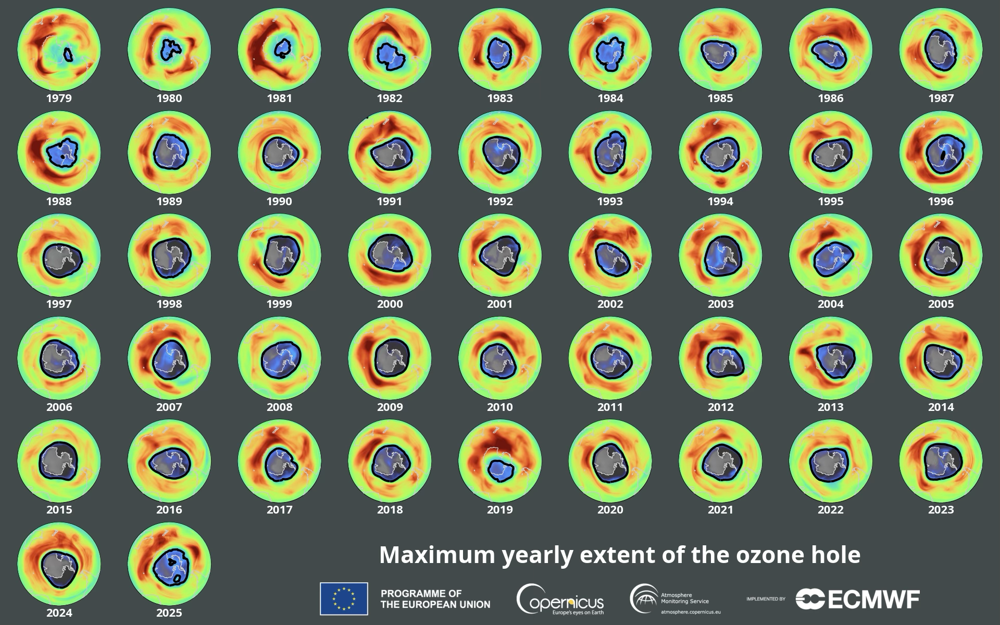
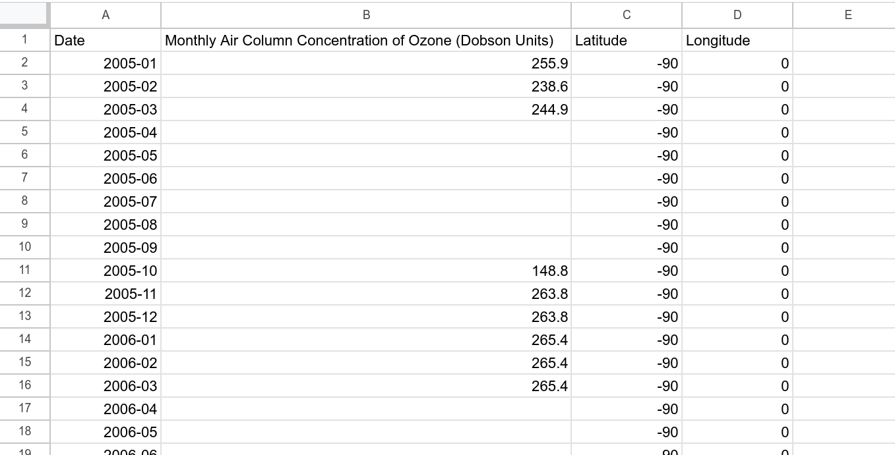
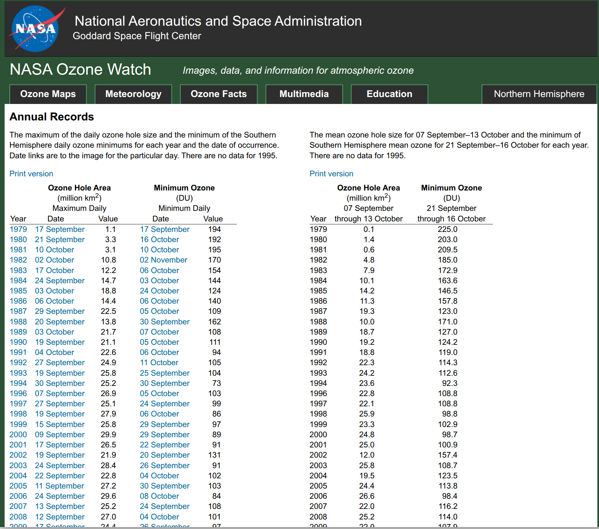

{height=300 fig-align="center"}

Let's look at the Ozone data from the NASA Earth System Data Explorer

This is Part 2 of looking at the data for ourselves on whether the Ozone layer is recovering and how fast. [Part 1](ozone1.html) was downloading data from the NASA Earth System Data Explorer

<b>Dislcaimer:</b> This is not an "official" NASA data analysis activity. This is a STEMcoding activity that uses NASA data.

## Step 1. Load the NASA Earth System Data Explorer data into your favorite spreadsheet program

In [Part 1](ozone1.html) you hopefully downloaded a CSV data file very similar [to this file](southpole2005_throughApril2026.csv). It was worth going through the steps in [Part 1](ozone1.html) because you might be able to get months or maybe a year of more recent data than the CSV data file provided.

If you look at this file before opening it in a spreadsheet program you will see something like this:

<pre>
Date,Monthly Air Column Concentration of Ozone (Dobson Units),Latitude,Longitude
2005-01,255.9,-90,0
2005-02,238.6,-90,0
2005-03,244.9,-90,0
2005-04,,-90,0
2005-05,,-90,0
2005-06,,-90,0
2005-07,,-90,0
2005-08,,-90,0
2005-09,,-90,0
2005-10,148.8,-90,0
2005-11,263.8,-90,0
</pre>

Notice that there are a lot of commas! The letters CSV stands for "Comma Separated Values". Instead of spaces between the values there are commas.

<b>Important Acronym:</b> 
CSV stands for "Comma Separated Values"

<b>Upload the CSV data file into your favorite spreadsheet program!</b>

You should be able to just "Open" the CSV data file. You may find that you need to "Import" the file.

## Step 2. Look at the data before you plot it!

Take a look at the data! The data is weird!

{height=300 fig-align="center"}

What are the units? Are there measurements of Ozone for every month of the year? Is the Ozone concentration constant or does it change with time? What other questions do you have?

<b>Important fact:</b> 
Because of the tilt of the earth's rotation, when it is summer in the Northern  hemisphere it is winter in the southern hemisphere, and the south pole  receives no sunlight from April until September

Ozone concentration is measured in "Dobson" units. 1 Dobson unit works out to $2.7 \cdot 10^{16}$ molecules of Ozone per square centimeter. More typically the Ozone concentration is around 300 Dobson units (look for example at the visualization at the [top of this page](ozone2.html#top)), so about $8.1 \cdot 10^{18}$ molecules of Ozone per square centimeter.

To understand what this means, remember that in the NASA Earth System Data Explorer we selected "Monthly Air Column Concentration of Ozone". The key word there is "Column" which is a word that should make you think of something tall.

Imagine that you built a very narrow but very tall tower that was 1 centimeter by 1 centimeter wide and it was so tall that it went from the ground all the way up to the top of the atmosphere. If the concentration of Ozone was 300 Dobson units, then this narrow but super tall tower would contain exactly $8.1 \cdot 10^{18}$ molecules of Ozone. This might seem like a lot of molecules of Ozone but it is actually <i>much</i> less than the number of water molecules in a glass of water (feel free to do that calculation!). The important thing is that these Ozone molecules absorb UV light from the sun so strongly that this is all it takes to protect us on the ground.

## Step 3. Plot up the data

Add an XY scatterplot to your spreadsheet. Put the month on the x axis and the Ozone concentration on the y axis.

This is a good opportunity to put the "Data cycle" in practice. There is no universally agreed upon series of steps in the data cycle, but generally you ask a question, take a quick look at the data, then you take a more detailed look at the data, then you do a bit of data storytelling, and then you maybe ask a new question, and so on.

Here are some questions to consider at this point:

* The plot shows how the Ozone concentration changes month-by-month, by eye does it seem like the Ozone concentrations are getting larger from 2005 until now?
* By eye does it seem like the Ozone concentrations are getting smaller from 2005 until now?
* Is the highest measured Ozone concentration closer to today or is it closer to 2005?
* Is the lowest measured Ozone concentration closer to today or is it closer to 2005?

## Step 4. Less is more

Instead of plotting the month-by-month data, what if you only showed one month of data per year? That's right: we're going to throw out all the data for each year except for one month. That way we can focus on the year-to-year changes instead of the month-to-month changes.  You get to choose the month (October, November, December, January, February or March).

Now return to the questions we discussed in [Step 3](ozone2.html#step-3.-plot-up-the-data). Is the Ozone concentration getting higher or lower with time?

Note: Ozone is part of the atmosphere which means that it has weather and variability. The video below is a visualization of Ozone data from 2025 from a [European Union satellite](https://atmosphere.copernicus.eu/monitoring-ozone-layer) 

The most important thing to take away from this video is that there is a lot going on down there at the South Pole and we are just looking at one number from one specific location at one specific time for how the Ozone layer is doing.

The second most important thing about this video is that the "hole" in the Ozone layer only exists for part of the year. We are ignoring this month-to-month variability but here is a quote from an [article from climate.gov](https://www.climate.gov/news-features/understanding-climate/4-ways-ozone-hole-linked-climate-and-1-way-it-isn%E2%80%99t) about month-to-month changes in the Ozone layer:

<i>"When the Sun rises at the end of Southern Hemisphere winter, sunlight degrades these reactive [CFC] gases, releasing 'free radicals' of chlorine. A single chlorine-containing free radical can catalyze the destruction of thousands and thousands of ozone molecules. Ozone destruction usually peaks in mid-October.  Ozone loss tapers off in late spring as the polar vortex weakens. Temperatures rise, and fewer clouds form. Ozone-rich air from lower latitudes mixes back into the polar stratosphere, and the ozone hole disappears until the next spring."</i>

## Step 5. NASA Ozone watch

There is another website that has data for the public about the Ozone layer. Whereas the NASA Earth System Data Explorer starts reporting data in late 2004, NASA Ozone watch includes data that goes back to 1979.

Check out [this page from NASA Ozone Watch](https://ozonewatch.gsfc.nasa.gov/statistics/annual_data.html) which you can see below:

[{height=500 fig-align="center"}](https://ozonewatch.gsfc.nasa.gov/statistics/annual_data.html)

There is a lot to take in on this page. It includes a size estimate for the area of the Ozone hole. And there are two different numbers for the Ozone concentration in Dobson Units (DU). The left side is "Minimum Daily Ozone concentration" which is the record lowest Ozone concentration for that year, while while the right side is the Ozone concentration during the time period from September 21 to October 16 for each year. <b>We recommend that you focus on the Ozone Concentration measurements on the right side.</b>

### Task #1: On the right side click "Print version" and download annual_data.txt

After you click "Print version" you can download the file with Control + S or right click and select "Save Page As..." The file you download is called annual_data.txt and it should look alot like [this file](annual_data.txt). You can download annual_data.txt from the link in the previous sentence, but it may not have the most recent data available.

### Task #2: Open annual_data.txt in your favorite spreadsheet program and plot concentration (y-axis) versus year (x-axis)

If it is easy to open up annual_data.txt in your spreadsheet program, that's great! But you may run into difficulty because it is formatted with spaces instead of with commas. annual_data.txt is NOT a CSV file.

One solution is to type the data into the spreadsheet manually. If that seems tedious another solution (if you are allowed to use AI) is to load annual_data.txt into an AI chatbot and ask it to convert annual_data.txt into CSV format. IF YOU DO THIS YOU WILL NEED TO CHECK THE NUMBERS!!! After you load the CSV file into your spreadsheet, make sure to check that the Ozone concentration versus year matches up with the numbers in annual_data.txt

## Step 6. Look at the NASA Ozone Watch data

The NASA Ozone watch data includes data from 1979 to 2004. What was happening to the Ozone layer then?

Go back and ask all the same questions as before:

* When was the Ozone concentration the highest?
* When was the Ozone concentration the lowest?
* Is the highest measured Ozone concentration near the beginning of the data in 1979 or the end of the data (circa 2025) or in the middle?
* Is the lowest measured Ozone concentration near the beginning of the data in 1979 or the end of the data (circa 2025) or in the middle?

Here is a new question:

* In 1987, a United Nations [treaty](https://en.wikipedia.org/wiki/Montreal_Protocol) was signed to phase out globally the manufacturing of chemicals that deplete the Ozone layer. If you were alive in 1987 and could see NASA's Ozone measurements from 1979 to 1987, what would you have been worried about for what the future might be like?

The [European Space Agency](https://atmosphere.copernicus.eu/smallest-and-shortest-lived-ozone-hole-5-years-closes) has [a visualization](esa_ozone_hole.png) of the Ozone hole versus year from 1979 to the modern day which is at the [top](ozone2.html#top) of this activity.

## Optional Extension #1

How does the NASA Ozone watch data compare to the NASA Earth System Data Explorer Monthly column Ozone data? Bear in mind that the NASA Ozone watch data is not measuring exactly the same thing as the NASA Earth System Data Explorer Monthly Column Ozone.

## Optional Extension #2

In the NASA Ozone watch data, is there a relationship between the size of the Ozone Hole Area and the Minimum concentration of Ozone? If you plot Ozone concentration on the x-axis and Ozone Hole Area on the y-axis, what does it look like? If the Minimum Ozone concentration is higher, is the Ozone Hole Area larger or smaller, and why?

