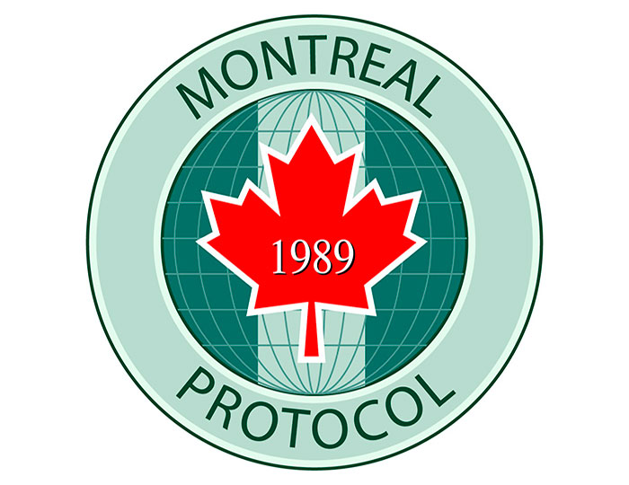
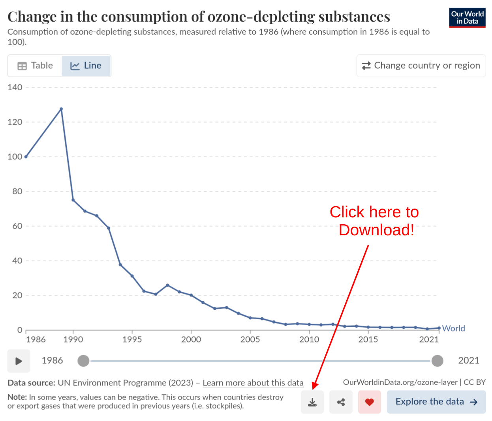

{height=300 fig-align="center"}

Let's talk about what happened in 1987 in Montreal and why it matters for the Ozone layer

This is Part 3 of looking at the data for ourselves on whether the Ozone layer is recovering and how fast. [Part 2](ozone2.html) was looking at data from the NASA Earth System Data Explorer and NASA Ozone watch

<b>Dislcaimer:</b> This is not an "official" NASA data analysis activity. This is a STEMcoding activity that uses NASA data.

## Step 1. Read about the Montreal Protocol and the history behind it

We are going to read an article called [How we fixed the Ozone layer](../how_we_fixed_the_ozone_layer.html) by a journalist and researcher named Hannah Richie which celebrates the 1987 Montreal Protocol which led to reductions in the production of chemicals that affect the Ozone layer.

The original article [is here](https://worksinprogress.co/issue/how-we-fixed-the-ozone-layer) but we are providing [this link](../how_we_fixed_the_ozone_layer.html) just in case people can't access that link or the link to the original article changes.

Here are a couple of things to note about the article:

* One of the main data sources is NASA Ozone watch! We just looked at that data in [Part 2](ozone2.html)
* The journalist is outlining a case for optimism about the recovery of the Ozone layer, does the data support optimism? Is it really true that the Ozone is "fixed"? What do you think?
* The main new data we have not discussed yet is the reduction of "Ozone depleting substances". This is really important!

The article does mention that the kind of international cooperation that happened to address the Ozone layer is similar to the kind of international cooperation that would be needed to address climate change, but that is not the main focus of the article. Even if it were, climate change and global warming are still part of science standards in [Ohio](https://education.ohio.gov/getattachment/Topics/Learning-in-Ohio/Science/Ohios-Learning-Standards-and-MC/SciFinalStandardsMC060719.pdf) and many other states.

## Step 2. Plot the "Ozone depleting substances" data alongside the Ozone concentration data

If you go to the first interactive figure in the article and click the download icon in the bottom right, you can download the data and we recommend that you click "Download displayed data" which ultimately will give you the file [ozone-depleting-substances-index.csv](../ozone-depleting-substances-index.csv)

Note that this data set DOES INCLUDE 1995 whereas the NASA Ozone watch data does NOT include 1995. And note that this data set DOES NOT include 1987 or 1988 even though NASA Ozone watch DOES INCLUDE 1987 and 1988.

An important thing to be able to do with a spreadsheet is to make a plot with a different y-axis on the left than on the right. This is helpful in situations where you are comparing two quantities as they change with time and that have different units. Here is some advice on how to do this:

### Google Sheets

If you open the Chart Editor and then click "Customize" and then click "Series". By default it will select "Apply to all series" but you should change that to select the Ozone depleting substances series. Once you select the Ozone depleting substances series, in that menu it will say "Axis" and you should change that from its default which is "left axis" to "right axis". You should immediately see numbers on the right side y-axis. You can adjust these values (for example the maximum and minimum) on a new area under "Customize" that says "Right vertical axis".

### Microsoft Excel

In the web version of Excel it seems not to be possible to have a different y-axis on the right side, however if you have Copilot enabled for web Excel you can ask it to create a "Vertical Secondary Axis" for a particular column of data.

If you have the desktop version of Excel it should be possible to do this without Copilot

## Step 3. Consider the results

Here are some things to consider with the result

* According to the data, how many years have there been so far of negligible production of Ozone depleting substances have there been? 5 years? 10 years? 15 years?
* Some experts say that it might take another 40 years of negligible production of Ozone depleting substances before the Ozone layer above the South Pole fully recovers. Does 40 years seem like a reasonable estimate? What do you think?

## Optional Extension: What does the Ozone levels look like above your town?

Earlier we used the [NASA Earth Systems Data Explorer](https://larc-mynasadata-2df7cce0.projects.earthengine.app/view/earth-system-data-explorer) to download Ozone data from above the South Pole, but you can specify any latitude and longitude and download a time series of that data.

### Figure out the latitude and longitude of your town

The easiest way is probably to do a google search, or a wikipedia search.

### Obtain a time series of Ozone concentration

Follow the directions in [Part 1](ozone1.html) to obtain Time Series data for the "Monthly Air Column Concentration of Ozone"

Plot up the data like you did in [Part 2](ozone2.html). What does it look like? Is there any trend for the Ozone concentration to be increasing or decreasing? If it is decreasing, then maybe we should wear more sunscreen!

## Optional Extension: Ground-level Ozone

Some factories and high voltage equipment produce Ozone. For example, if your science teacher has a [plasma globe](https://en.wikipedia.org/wiki/Plasma_globe) you may have smelled Ozone being produced by the high voltage. 

Ozone near the ground can be a problem for humans, plants and animals because Ozone can react with molecules in our bodies. So although we want Ozone in the upper atmosphere, we do not want Ozone near the ground. Here is another [figure from Hannah Richie](../img/Ozone-zones-in-atmosphere-01.png)
that is helpful for understanding the difference between upper atmosphere Ozone and ground level Ozone

The Environmental Protection Agency considers "ground-level ozone" to be a major air pollutant, and the [Air Quality Index (AQI)](https://www.airnow.gov/aqi/aqi-basics/) does depend on the ground-level concentration of ozone if it is high enough.

An interesting project that examines the effect of ground-level Ozone on plants is the [Ozone Garden Network](https://research.cgd.ucar.edu/ozone-garden/). Look at the map on that page. Maybe there is an Ozone garden near you!