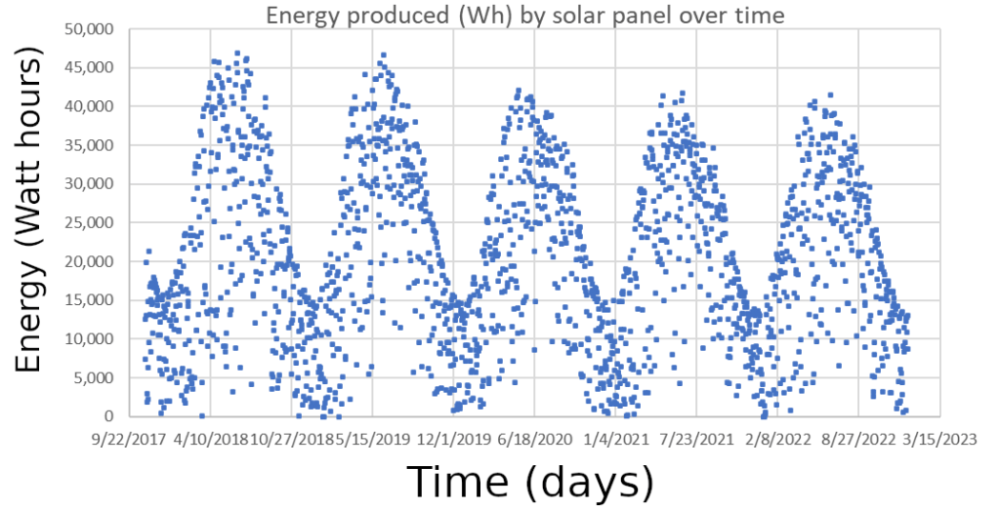

{width=600 fig-align="center"}

## Links to Activity

[Solar cell data repository](https://github.com/stemcoding/stemcoding.github.io/tree/master/solar)  (Note: solar2.csv has 9 years of data, which is more than the others)

[Student Worksheet (PDF)](solar_cell_student_worksheet.pdf)

[Student Worksheet (MS Word)](solar_cell_student_worksheet.docx)

[Teacher Guide (PDF)](solar_cells_teacher_guide.pdf)

[Teacher Guide (MS Word)](solar_cells_teacher_guide.docx)

